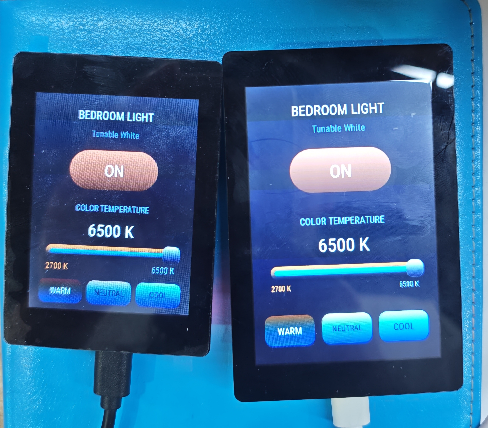
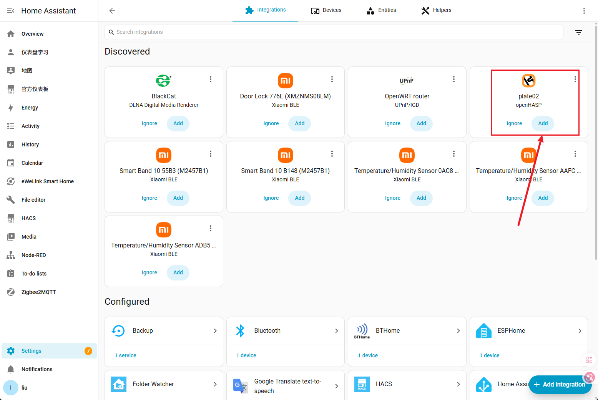

# OpenNextion openHASP

[](./README.md)
[](./README.zh-CN.md)


<p align="center"></p>

https://github.com/user-attachments/assets/f0558cf5-25b8-4e8d-ab3c-28edd55e0f63

将已支持的 OpenNextion ESP32-S3 触摸屏变成可配置的 MQTT 家庭自动化面板。烧录对应型号的固件、连接 Wi-Fi、配置 MQTT 后，即可通过设备网页和页面文件制作灯光、空调、媒体、场景等控制界面，并接入 Home Assistant。

> 本项目基于 [openHASP](https://github.com/HASwitchPlate/openHASP) 适配 OpenNextion 硬件，并非 OpenNextion 或 Home Assistant 官方产品。

## 支持的硬件

| OpenNextion 型号 | 显示屏 | 方向 | PlatformIO 环境 | 状态 |
| --- | --- | --- | --- | --- |
| [ONX3248G035][onx3248g035] V1.2 | 3.5 英寸电容触摸屏，320 × 480 | 竖屏 | `onx3248g035` | 已验证 |
| [ONX2432G028][onx2432g028] V1.3 | 2.8 英寸电容触摸屏，240 × 320 | 竖屏 | `onx2432g028` | 已验证 |

**只能烧录与设备型号完全匹配的固件，请勿在两款面板之间交叉刷写。**

当前已支持显示、触摸、背光、Wi-Fi、LittleFS 和 PSRAM。音频、RTC、SD 卡、摄像头及通过 PCF8574A 扩展的 IO 尚未适配。

## 开始前准备

- 一台受支持的 OpenNextion 面板。
- 一条支持数据传输的 USB 线，而不只是充电线。
- Windows、macOS 或 Linux 电脑。
- 2.4 GHz Wi-Fi 网络；ESP32-S3 不支持仅提供 5 GHz 的 Wi-Fi。
- 一个可用的 MQTT Broker；使用 Home Assistant 时，常用选择是 Mosquitto Broker 附加组件。

## 快速上手

### 1. 获取正确的固件

发布固件可从 [GitHub Releases](https://github.com/OpenNextion/OpenNextion-Example-openHASP/releases/tag/v0.7.0.1) 下载。

| 设备 | 首次完整刷写固件 | OTA 固件 |
| --- | --- | --- |
| ONX3248G035 V1.2 | `open_hasp_V0.7.0.1_merged_ONX3248G035.bin` | `v0.7.0.1` 未提供 |
| ONX2432G028 V1.3 | `open_hasp_V0.7.0.1_merged_ONX2432G028.bin` | `v0.7.0.1` 未提供 |

这两个 Release 附件均为从地址 `0x0` 进行首次 USB 烧录的完整合并镜像，并非 OTA 升级包。请只使用与设备型号完全匹配的文件。

| 固件文件 | 大小 | SHA256 |
| --- | ---: | --- |
| `open_hasp_V0.7.0.1_merged_ONX3248G035.bin` | `1744288` 字节 | `cccc91a8f43011706d2f1b65c973c84f190389d082f952a91a53aa460583a384` |
| `open_hasp_V0.7.0.1_merged_ONX2432G028.bin` | `1744288` 字节 | `c4cfe0de810d6b78a84286245f0dcf67d53a7a4e41b4b4845c666e21ec8a00ac` |

### 2. 烧录面板

用支持数据传输的 USB 线连接面板，并烧录与设备型号完全匹配的完整合并镜像。请将 `<SERIAL_PORT>` 替换为操作系统中的实际串口设备：

```sh
# ONX3248G035 V1.2
python -m esptool --chip esp32s3 -p <SERIAL_PORT> -b 460800 write_flash \
  0x0 ./open_hasp_V0.7.0.1_merged_ONX3248G035.bin

# ONX2432G028 V1.3
python -m esptool --chip esp32s3 -p <SERIAL_PORT> -b 460800 write_flash \
  0x0 ./open_hasp_V0.7.0.1_merged_ONX2432G028.bin
```

若电脑未出现串口设备，先尝试更换 USB 线或 USB 接口。若烧录工具无法连接，请按住 **BOOT**，短按并松开 **Reset**，再松开 **BOOT** 后重试。

### 3. 连接面板到 Wi-Fi

首次启动或清除 Wi-Fi 设置后，面板会创建名为 `HASP-xxxxxx` 的临时热点，密码为 `haspadmin`。

1. 扫描面板显示的二维码，或用手机、电脑连接到临时热点。
2. 按屏幕的 Wi-Fi 设置提示操作，选择你的 2.4 GHz Wi-Fi 并输入密码。
3. 保存设置，等待面板重启并加入家庭网络。
4. 在路由器客户端列表中找到面板 IP 地址，再用浏览器打开该地址。

设备网页可用于查看状态、配置 MQTT、编辑文件、更新固件和恢复出厂设置。

<p align="center"></p>

### 4. 配置 MQTT 和 Home Assistant

在设备网页中打开 **Settings → MQTT Settings**，填写：

- **Broker**：MQTT Broker 的 IP 地址或主机名。
- **Port**：通常为 `1883`。
- **Username** 和 **Password**：Broker 启用认证时填写。
- **Hostname**：为此面板设置唯一名称，例如 `livingroom_panel`。
- **Node Topic**：未使用自定义主题规划时保持默认即可。

保存设置并等待面板重新连接。若 Home Assistant 的 MQTT 集成使用相同 Broker，可在 **设置 → 设备与服务 → MQTT** 中查找面板及其自动发现的实体。若未出现，先在面板网页的 **Information** 页面确认 Wi-Fi 和 MQTT 已连接。

<p align="center"></p>

### 5. 创建第一个面板页面

默认页面用于确认显示、触摸和 MQTT 连接正常。在设备网页中打开 **File Editor**，可查看、上传或编辑页面文件与图片；修改前请先下载备份。

通过 Home Assistant 自动化或 MQTT 消息，可以更新标签、图标、颜色、数值和页面。[openHASP 文档](https://www.openhasp.com/) 提供页面对象和 MQTT 指令说明。

## 日常操作

| 需求 | 操作位置 |
| --- | --- |
| 查看 IP、Wi-Fi、MQTT 与固件信息 | 设备网页的 **Information** |
| 修改 Wi-Fi、MQTT、显示或时间设置 | 设备网页的 **Settings** |
| 备份或编辑页面、图片 | **File Editor**；先备份 |
| 重新安装或更新 `v0.7.0.1` | 通过 USB 烧录对应型号的完整合并镜像；此版本未提供 OTA 固件 |
| 重新开始 | **Factory Reset**；会清除设置和内部文件 |

## 常见问题

### 电脑找不到面板

请使用支持数据传输的 USB 线，并尝试其他 USB 接口。部分 USB 线只能供电。若仍未出现串口，请安装操作系统所需的 USB 串口驱动。

### 上传工具无法连接

重新拔插 USB 后重试。必要时按住 **BOOT**，短按并松开 **Reset**，再松开 **BOOT**，然后重新上传。

### 构建时出现 `ft2build.h: No such file or directory`

缺少 FreeType Git 子模块。请在项目目录运行：

```sh
git submodule update --init --recursive
```

然后重新构建。

### 面板无法连接 Wi-Fi

确认所选网络提供 2.4 GHz Wi-Fi，并检查网络名称和密码。必要时恢复出厂设置，再执行首次配网。

### Home Assistant 中没有面板

确认 Home Assistant 与面板使用同一个 MQTT Broker。在面板 **Information** 页面确认 MQTT 已连接，然后重启面板并等待其重新连接。

### 显示异常或刷错了固件

通过 USB 重新刷写与面板型号完全匹配的完整固件。不要安装为另一型号准备的 OTA 文件。

## 外壳与图片

<!-- 图片待补充：外壳与安装
建议路径：
  docs/images/onx3248g035-openhasp-enclosure.jpg
  docs/images/onx2432g028-openhasp-enclosure.jpg
请提供：每个型号各一张光线充足的斜侧实拍图，展示面板装入打印外壳后的效果；同时提供各型号 3D 模型的最终公开下载链接（例如 MakerWorld）。
-->

3D 打印桌面外壳和安装图片将于后续补充。

| 型号 | 3D 外壳 |
| --- | --- |
| ONX3248G035 V1.2 | 待补充链接 |
| ONX2432G028 V1.3 | 待补充链接 |

## 从源码构建

本节适用于需要修改项目，或希望自行构建并上传固件的用户。

1. 安装 [PlatformIO](https://platformio.org/)，并带子模块克隆仓库：

   ```sh
   git clone --recurse-submodules https://github.com/OpenNextion/OpenNextion-Example-openHASP.git
   cd OpenNextion-Example-openHASP
   ```

   如果仓库已经克隆完成，请初始化必需的 FreeType 子模块：

   ```sh
   git submodule update --init --recursive
   ```

2. 将 `platformio_override-template.ini` 复制为 `platformio_override.ini`。

3. 在 `platformio_override.ini` 的 `[platformio]` 中取消下面一行的注释：

   ```ini
   user_setups/esp32s3/*.ini
   ```

4. 在 `[override]` 的 **Nextion** 区域中，取消一个匹配目标的注释：

   ```ini
   onx3248g035
   ; 或
   onx2432g028
   ```

5. 在项目目录构建或上传：

   ```sh
   pio run -e onx3248g035
   pio run -e onx3248g035 -t upload
   ```

开发板配置文件位于 [onx3248g035.ini](user_setups/esp32s3/onx3248g035.ini) 和 [onx2432g028.ini](user_setups/esp32s3/onx2432g028.ini)。

## 致谢、许可证与免责声明

- 上游项目：[openHASP](https://github.com/HASwitchPlate/openHASP)
- 图形库：[LVGL](https://lvgl.io/)
- OpenNextion：<https://github.com/OpenNextion>

本项目遵循仓库中的 [LICENSE](LICENSE)。第三方组件可能有各自的许可证声明。

刷写第三方固件可能导致设备损坏或数据丢失。请确认固件与面板型号匹配，并在修改面板文件前做好备份。

[onx3248g035]: https://nextion.tech/wiki/onx3248g035/
[onx2432g028]: https://nextion.tech/wiki/onx2432g028/
